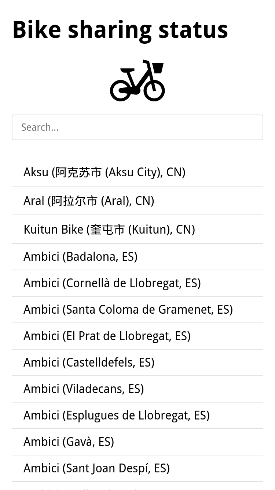
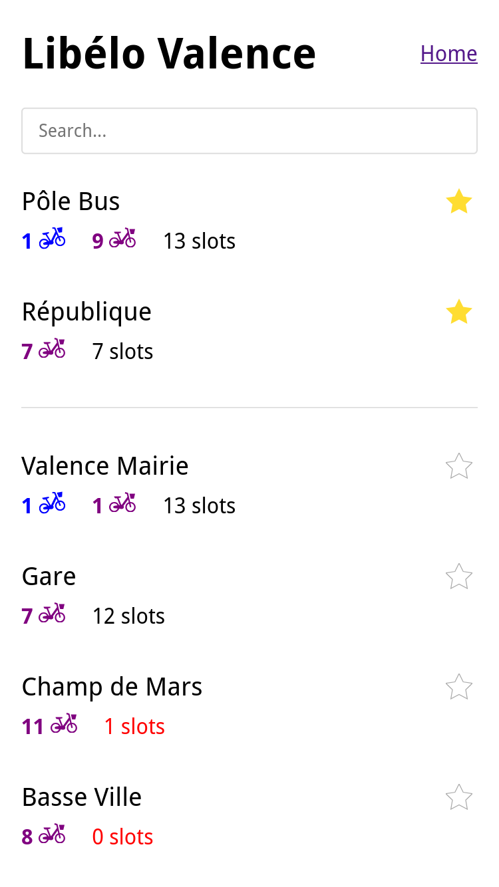

# Mini PBS: Minimal Public Bike Sharing Status App

Many <abbr title="Public Bike Share">PBS</abbr> system have an application to consult the availablity
of bikes on stations. But sometimes I did not want to open these bloated apps just to check the status
of my regular stations. So I made a (very) lightweight webapp to display the data from the API of
these public bike share systems.

[Open the app](https://mini-pbs.delhor.me/)




## Features

- More than 700 bike sharing systems available around the world (via [pybikes](https://github.com/eskerda/pybikes))
- List the availability of mechanical and electrical bikes on all stations
- Pin your regular stations to the top of the list (and bookmark your configuration)
- Lightweight page (< 80ko), minimal UI
- no cookies, no login


## Develop

The app is made with [Flask](https://flask.palletsprojects.com/en/stable/), a python web framework. It 
is based on [pybikes](https://github.com/eskerda/pybikes) a library that provides coherent status data
from more than 700 bike sharing systems.

### Install

```sh
git clone https://github.com/adrien-delhorme/libelo
cd libelo/
python3 -m virtualenv .venv
source .venv/bin/activate
python3 -m pip install -r requirements.txt
```

### Run

```sh
source .venv/bin/activate
python3 -m flask --app application run
```
