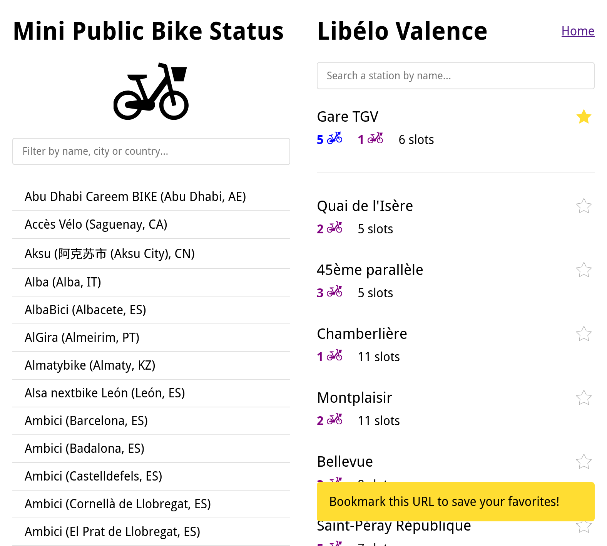

# Mini PBS: Minimal Public Bike Status App

A minimal webapp to check your daily bike stations in one click and a fraction of a second.

Many <abbr title="Public Bike Share">PBS</abbr> system have an application to consult the availablity
of bikes on stations. But these applications are often cumbersome, slow and impractical. So I made a (very) lightweight webapp to display your daily bike stations with the data of the <a href="https://api.citybik.es/v2/" target="_blank">CityBikes API</a>.



## Use

[Open the webapp](https://mini-pbs.delhor.me/)

The features are:

- More than 700 bike sharing systems available around the world (via the <a href="https://api.citybik.es/v2/" target="_blank">CityBikes API</a>)
- List the availability of mechanical and electrical bikes on all stations
- Pin your regular stations to the top of the list (and bookmark your configuration)
- Lightweight page (< 80ko), minimal UI
- no cookies, no login


## Develop

The app is made with [Flask](https://flask.palletsprojects.com/en/stable/), a Python web framework. It 
is based on the <a href="https://api.citybik.es/v2/" target="_blank">CityBikes API</a> that provides coherent data from more than 700 bike sharing systems.

### Install

```sh
git clone https://github.com/adrien-delhorme/mini-pbs
cd mini-pbs/
python3 -m virtualenv .venv
source .venv/bin/activate
python3 -m pip install -r requirements.txt
```

### Run

```sh
source .venv/bin/activate
python3 -m flask run
```
